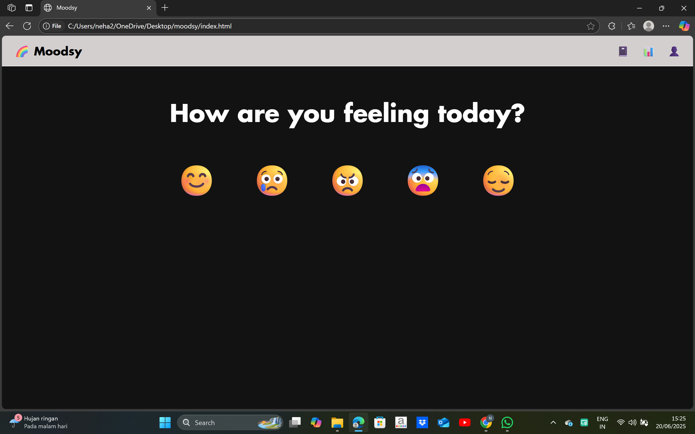
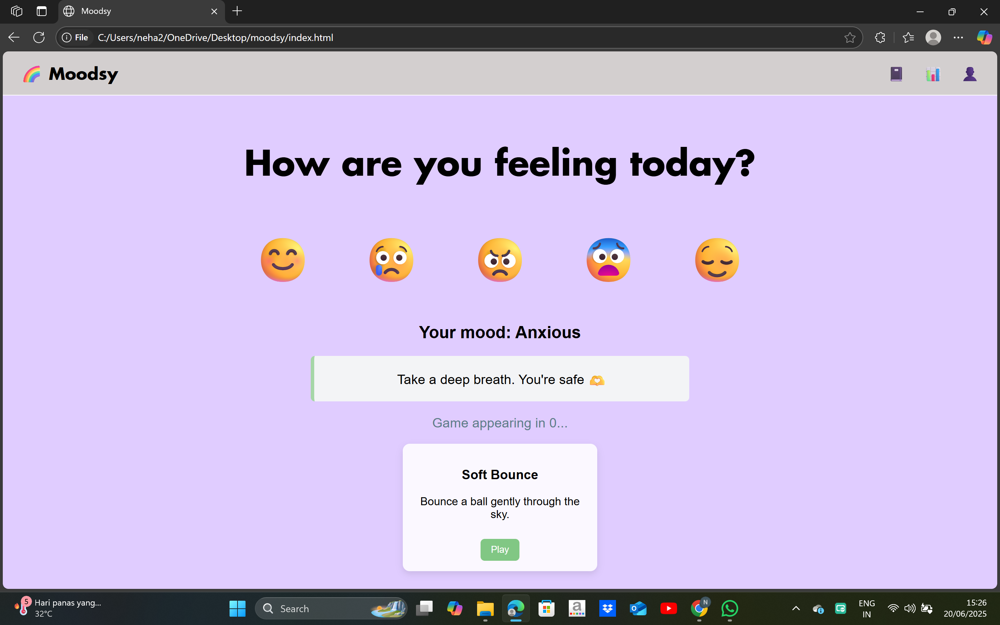
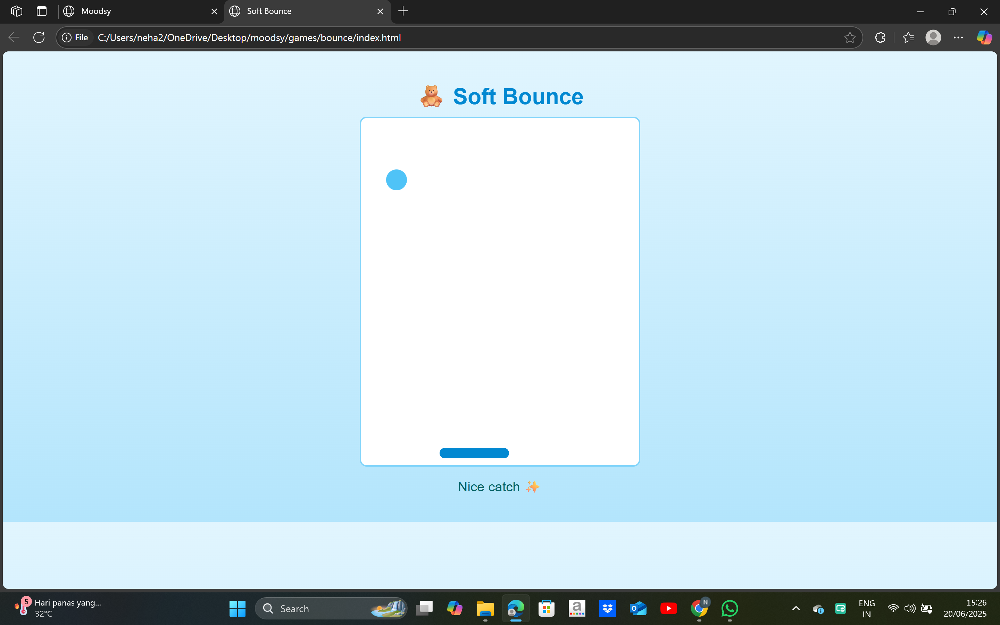
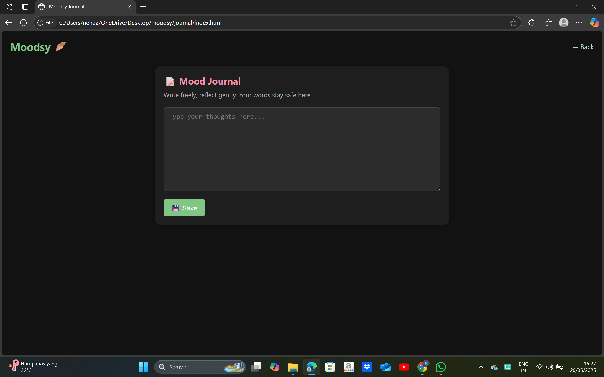
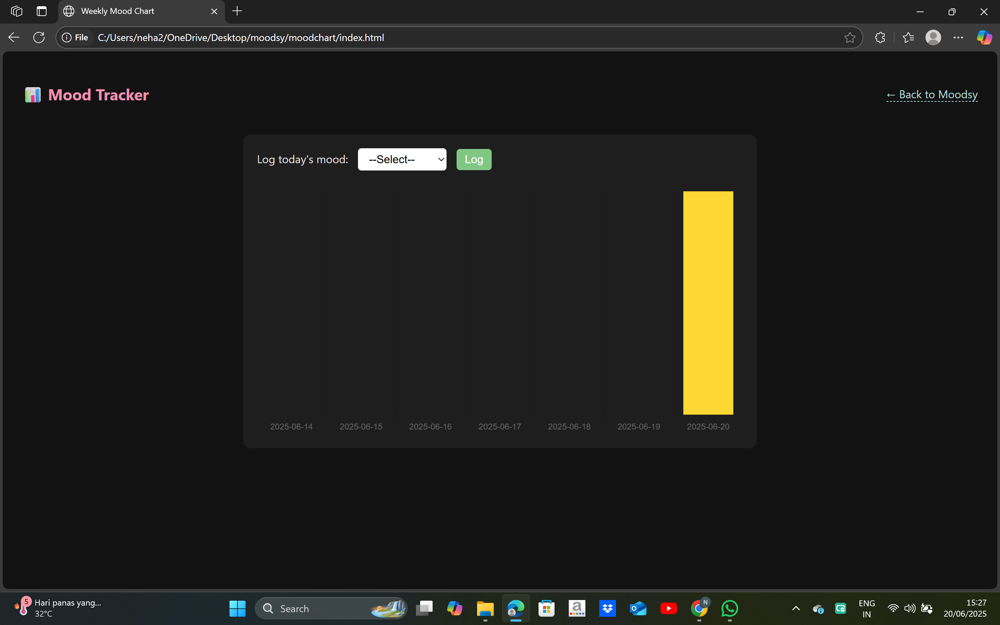

# 🌈 Moodsy – Emotion-Aware Mental Wellness Hub

**Moodsy** is a personalized and mood-responsive wellness platform designed to uplift users through games, tools, and emotional awareness. Whether you're feeling happy, sad, anxious, or just neutral — Moodsy adjusts to support you.

---

## 🎯 Features

- 🎮 **Mini Games** – Play quick and calming games designed to boost your mood.
- 📊 **Mood Tracker** – Weekly chart to visualize emotional trends using Chart.js.
- 📔 **Mood Journal** – Safe space to write, vent, and reflect.
- 🎧 **Focus Room** – Relax with soft music, breathing tools, and calming visuals.
- 🎨 **Dynamic UI** – Layout and colors adapt based on the selected mood.

---

## 🛠️ Tech Stack

- **Frontend**: HTML, CSS, JavaScript
- **State & Storage**: LocalStorage (for now)
- **Charts**: Chart.js
- **Planned Backend**: Node.js, MongoDB

---

## 🚀 Getting Started

1. Clone the repository:
   ```bash
   git clone https://github.com/neha23jk/moodsy-project.git
2. Open the project folder in your IDE (e.g., VS Code).
3. Run `index.html` directly in your browser  
   **OR**  
   Use a local development server like **Live Server** in VS Code for better performance and routing.

---

## 📌 Future Goals

- Add emotion detection via webcam or sentiment analysis
- Implement secure user login with MongoDB + Node.js
- Make the UI fully mobile responsive
- Add daily mood check-in reminders or notifications

---

## 🧑‍💻 Author

Made with care by **Neha Chaudhary** – ECE student at IIIT KOTA working on Web Development and DSA.

---

## 📄 License

This project is licensed under the **Apache License 2.0**.  
You are free to use, modify, and distribute this code with proper attribution.  
See the full license details in the [LICENSE](LICENSE) file.

---

## 🖼️ Screenshots

### 🏠 Homepage (Mood Selector)


### 🎨 Mood Selector


### 🎮 Mini Game


### 📔 Journal Section


### 📊 Mood Tracker


